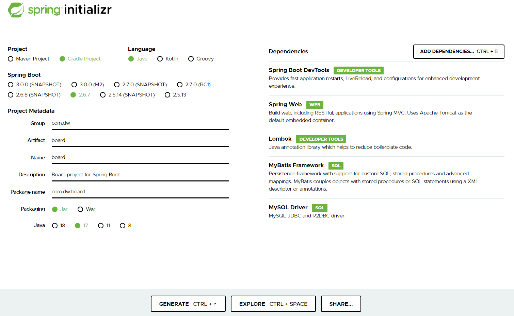

- # <a href="https://start.spring.io/">spring initializr</a>



```
1. 왼쪽 부분은 회사와 java버젼에 맞게 설정하면 된다.
2. 오른쪽 부분(ADD DEPENDENCIES...CTRL + B)은 클릭해서 원하는것 다운로드(추가).
3. GENERATE CTRL + Enter 클릭하면 .zip파일 다운로드 받아짐.
4. IDE 실행 파일(spring-workspace)에 넣은뒤 '여기에 압축풀기' 클릭!
5. IDE(스프링,이클립스) 들어가서 임포트 하기!
6. .propertis 파일을 .yaml로 파일로 바꾸고 파일 들어가서

     type-aliases-package : 데이터를 받을 패키지 경로)변경해주기!

7. banner파일과 logback파일(mapper위치 변경하기) resources패키지에 추가
8. resources패키지에 sqlmap패키지 생성 후 sqlmapper.xml 파일 생성
9. java패키지에 MVC(vo,mapper,service,controller) 생성
10. 클래스 파일 생성
11. "hello word!" 찍어 보기
```

- ## 다운로드 받은 목록 의미

```
1. Spring Boot DevTools : 저장하면 자동으로 reload(새로고침)됨.
2. Spring Web : Spring 웹 기본!
3. Lombok : getter, setter, 생성자 등등
4. MyBatis Framework : ORM(Object Relational Mapping)을 사용하기 위한 MyBatis 다운로드
5. MySQL Driver : MySQL에서 데이터를 연동하기 위해 다운로드
```
