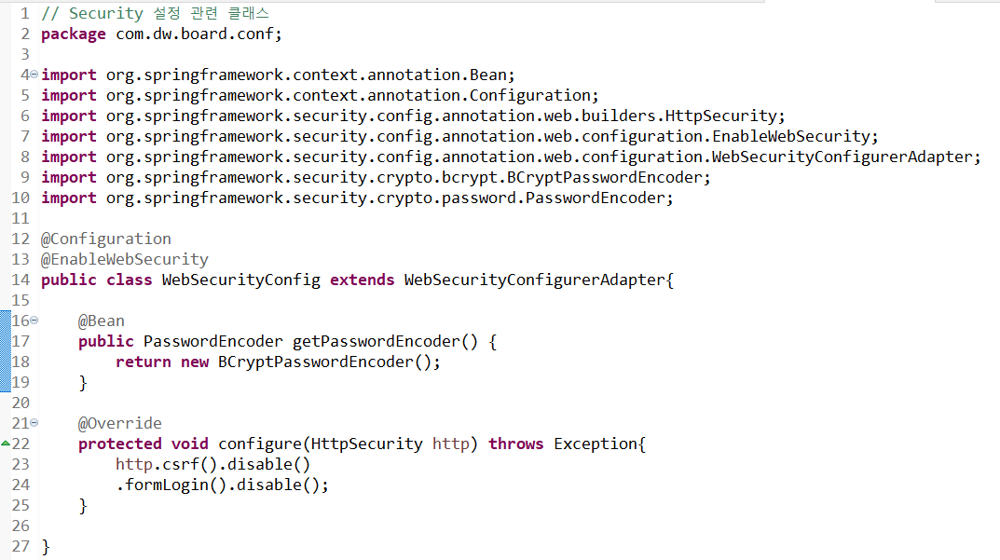

- ### conf 패키지 : Spring 설정 관련 클래스 모음 패키지
- ### WebSecurityConfig 클래스 : Web Security 설정 관련 모음 클래스

=====================================================================



- ## WebSecurityConfig.java 클래스 내용
- ### @Configuration,@EnableWebSecurity,@Bean : 어노테이션 간단정리.md 파일 참고!

=====================================================================


- ### @Autowired 어노테이션으로 PasswordEncoder 호출
- ### 입력한 password를 가져와서(get) 암호화를 하는 passwordEncoder.encode(암호화할 password 입력) 암호화한 password를 다시 set해주어야 한다.

=====================================================================


- ## 암호화 완료된 결과

  =====================================================================

- # 암호화하는 과정 로직

### config패키지 안에 WebSecurityConfig.java 클래스

```java
// Security 설정 관련 클래스
// WebSecurityConfig 클래스
package com.dw.board.conf;

import org.springframework.context.annotation.Bean;
import org.springframework.context.annotation.Configuration;
import org.springframework.security.config.annotation.web.builders.HttpSecurity;
import org.springframework.security.config.annotation.web.configuration.EnableWebSecurity;
import org.springframework.security.config.annotation.web.configuration.WebSecurityConfigurerAdapter;
import org.springframework.security.crypto.bcrypt.BCryptPasswordEncoder;
import org.springframework.security.crypto.password.PasswordEncoder;

@Configuration
@EnableWebSecurity
public class WebSecurityConfig extends WebSecurityConfigurerAdapter{

	@Bean
	public PasswordEncoder getPasswordEncoder() {
		return new BCryptPasswordEncoder();
	}

	@Override
	protected void configure(HttpSecurity http) throws Exception{
		http.csrf().disable()
		.formLogin().disable();
	}

}
```

### Service 클래스

```java
// sevice클래스
package com.dw.board.sevice;

import java.util.List;
import java.util.Map;

import org.springframework.beans.factory.annotation.Autowired;
import org.springframework.security.crypto.password.PasswordEncoder;
import org.springframework.stereotype.Service;
import org.springframework.transaction.annotation.Transactional;

import com.dw.board.mapper.StudentsMapper;
import com.dw.board.vo.StudentsVO;

@Service
public class StudentsService {

	@Autowired
	private StudentsMapper studentsMapper;
	@Autowired
	private PasswordEncoder passwordEncoder;
    //

	// 학생 저장
	public int getInsertStudents(StudentsVO vo) {
		// 학생비밀번호 암호화
		String password = vo.getStudentsPassword();
		// DB에 생성할 입력한 비밀번호를 가져온다.
		System.out.println("암호화 전 => "+password);

		password = passwordEncoder.encode(password);
		// 암호화할 클래스.메소드(파라미터)에 비밀번호를 대입해준다.
		System.out.println("암호화 후 => "+password);
		vo.setStudentsPassword(password);
		// 암호화한 비밀번호를 다시 set하여 VO필드변수에 단방향 암호화한 password를 값으로 넣어준다.
		int rows = studentsMapper.insertStudents(vo);
		return rows;
	}

	// 가입된 학생인지 아닌지 여부 체크(가입된 학생데이터와 가입할 학생데이터 비교)
		@Transactional(rollbackFor = {Exception.class})
		public boolean isStudents(StudentsVO vo) {

			StudentsVO student = studentsMapper.selectStudentsOne(vo);
			// Mapper에 있는 메소드 파라미터에 쿼리의 결과(암호화된 password를 담은 vo)를 받아서
			//	StudentsVO student에 대입!
			// 그러면 메소드 파라미터에 있는 vo는 HTML에서 가져온 데이터이고
			// 변수 student는 DB에서 가져온 데이터이다.
			if(student == null) {
				//쿼리 결과가 null로 리턴되면 return false;
				return false;
			}

			String inputPassword = vo.getStudentsPassword();//HTML에서 받아온 비밀번호
			String password = student.getStudentsPassword();//DB에서 가져온 비밀번호
			if(passwordEncoder.matches(inputPassword, password)) { //비밀번호 체크
				//matches함수는 암호화된 비밀번호와 입력한 비밀번호를 비교해주는 메소드이다.
				//if문에는 inputPassword와 password를 비교하여 비밀번호가 겹치지 않게 비교해주는 matche함수 사용!
				return false;
			}

			// 쿼리의 결과가 null이 아니고 inputPassword와 password가 겹치지 않는다면 retrun true;
			return true;
		}
}
```
