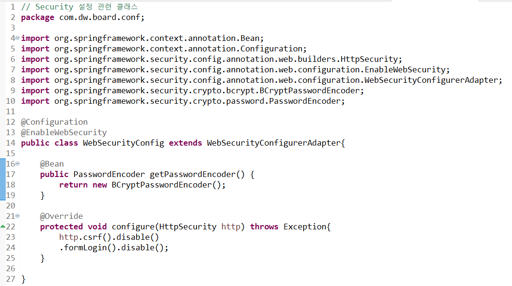

- ### conf 패키지 : Spring 설정 관련 클래스 모음 패키지
- ### WebSecurityConfig 클래스 : Web Security 설정 관련 모음 클래스

=====================================================================

- ## WebSecurityConfig.java 클래스 내용
- ### @Configuration,@EnableWebSecurity,@Bean : 어노테이션 간단정리.md 파일 참고!

=====================================================================

- ### @Autowired 어노테이션으로 PasswordEncoder 호출
- ### 입력한 password를 가져와서(get) 암호화를 하는 passwordEncoder.encode(암호화할 password 입력) 암호화한 password를 다시 set해주어야 한다.

=====================================================================

- # 암호화 완료된 결과
