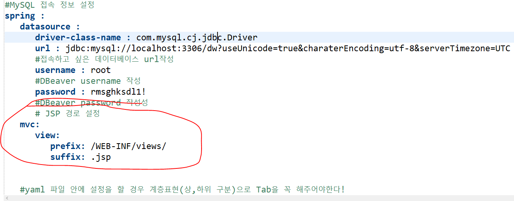

- # JSP 설정방법

### 1. jsp는 html 안에서 java코딩이 가능한 파일이다.

### 2. jsp파일과 html 파일의 차이점은 jsp는 language="java"라고 적혀있고 java 문법을 사용 할 수 있다.

```java
1. 프로젝트 오른쪽 마우스 클릭 후 Source Folder 클릭후 이름 src/main/webapp 로 설정
2. 패키지가 생기면 webapp패키지 오른쪽 마우스 클릭 후 제너럴 -> 폴더 -> webapp 폴더 클릭 후 이름 WEB-INF 로 설정
3. WEB-INF 오른쪽 마우스 클릭 후 폴더 만들기 이름은 views 로 설정
4. views 오른쪽 마우스 클릭 NEW ->  Other -> Web -> JSPfile -> index.jsp(이름 설정) -> finish 클릭
5. views폴더안에 index.jsp 파일이 생성됨.
6. jsp로 쓸거야라는 것을 설정 해주어야함. yaml파일 들어가서
    spring : 하위 관계로 설정하여야한다.
        # JSP 경로 설정
        mvc :
            prefix : /WEB_INF/views
            suffix : .jsp
7. .geadle 파일 들어가서 dependencies안에 JSP다운로드 후 refresh

    // JSP다운로드
    implementation "org.apache.tomcat.embed:tomcat-embed-jasper"
	implementation 'javax.servlet:jstl'

8. .geadle 파일 refresh하면 webapp 패키지 사라지는데 당황하지말고 scr폴더에 들어가면 있다(webapp폴더가 들어있음)!
9. resoueces폴더안에 static 폴더에 css , images, js 폴더 생성
10. js폴더에 index.js 파일 추가
11. .yaml파일 들어가서 css,js,image 폴더 위치 설정

    #css,js,image 폴더 위치 설정
      static-path-pattern: /resources/static/**

12. .jsp파일 들어가서 script태그 생성
    <script type="text/javascript" src="/resources/static/js/index.js"></script>
    // src에 경로 설정!
```

_yaml파일에 JSP 경로 설정 위치_



_yaml파일에 css,js,image 폴더 위치 설정_


