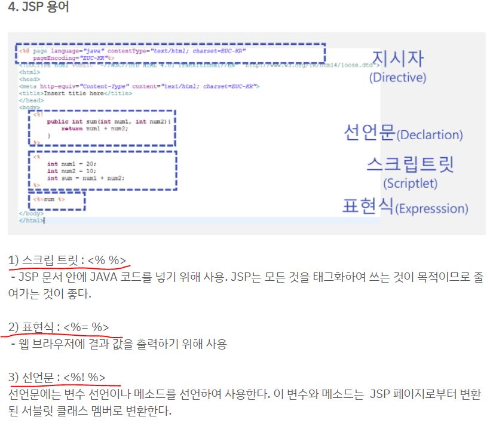
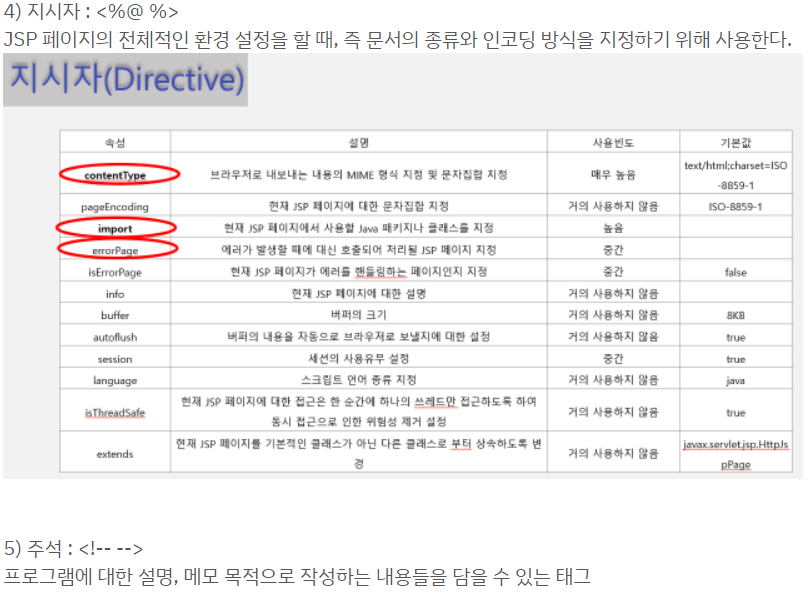

# JSP(Java Server Pages)기본 개념

```
1. HTML코드에 JAVA코드를 넣어서 동적으로 웹페이지를 구성할 수 있게 만드는 웹 어플리케이션 도구이다.
2. JSP는 하나의 JAVA클래스이기 때문에 모든 JAVA라이브러리를 사용할 수 있다.
3. Spring boot의 view에 속한다.
4. JSP는 템플릿엔진으로써 JSP를 사용한다면 @RestController가 아닌 @Controller를 사용한다.

5. JSP는 데이터를 내부에서 불러온다.(jsp파일 안에 HTML + CSS + JavaScript + Java 가능(AJAX도 사용가능))
    <-> JSP를 사용하지 않을경우 HTML을 따로 작성 하여 데이터를 외부에서 불러온다.

6. .JSP을 사용할경우 JSP파일에 HTML + CSS + JavaScript + Java 모두를 사용할 수 있다.(AJAX도 사용가능)
7. retrun값을 데이터값이 아닌 **파일명으로 받아준다.

8. Controller클래스에서 jsp파일로 key값을 넘겨줄 경우에는 파라미터에 'ModelMap map'를 입력 한뒤 .addAttribute를 사용하여 넘겨준다.
    8-1) ex) map.addAttribute("wsgList", list);

9. controller에서 받아온 값은 '${}'문법을 사용하여 접근한다.
    9-1) ${wsgList}
```

```
1. 동적 웹 : DB와 연동하여 HTML에 데이터 추가/수정을 해서 보여주는 방식이다.
2. 정적 웹 : HTML+CSS파일만 그대로 보여주는 것이다.
```



